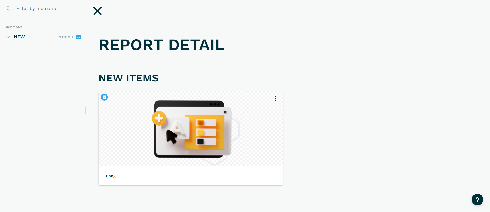
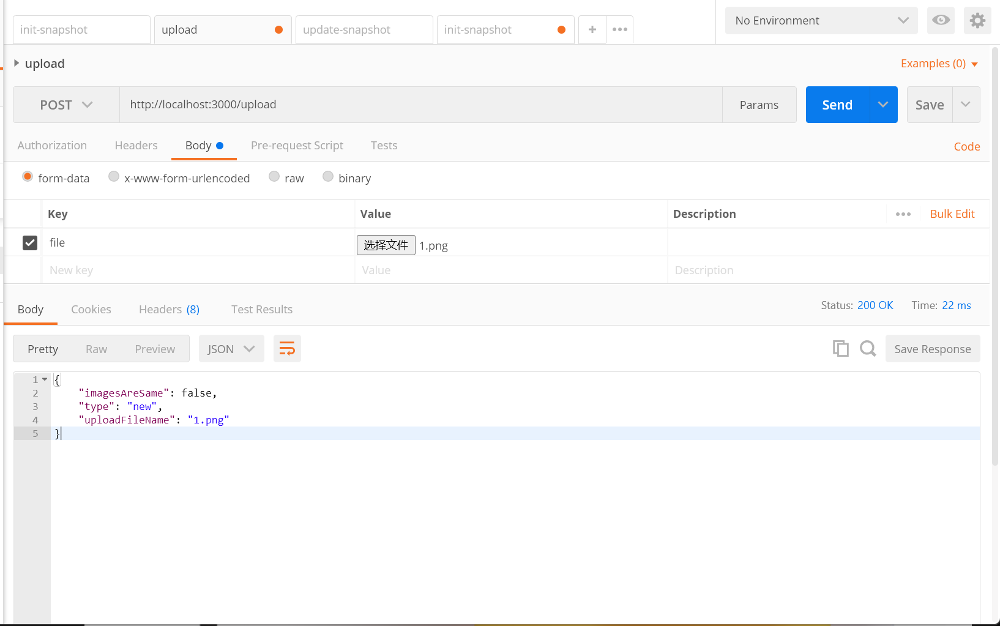

# visual-test-api
> 通过上传图片，进行视觉测试

# API

- `/ [GET]` : 显示测试报告,效果如下图



- `/init-snapshot [POST]`: 初始化测试数据
- `/upload [POST]`: 上传图片，判断图片视觉是否一致。已 form-data 格式上传，key 为 file, 结果如下图



返回格式
```json
{
  "imagesAreSame": false, // 视觉是否一致
  "type": "new", // new:没有匹配到对应的对比图片, passed:视觉一致, changed:视觉不一致
  "uploadFileName": "1.png" // 上传图片名称
}
```

- `/update-snapshot [POST]`: 更新 expected image 数据(Copy `actual` to `expected`)

上传数据
```json
  {
    "name": "1.png" // 之前上传图片的名称
  }
```

返回格式
```json
{}
```


